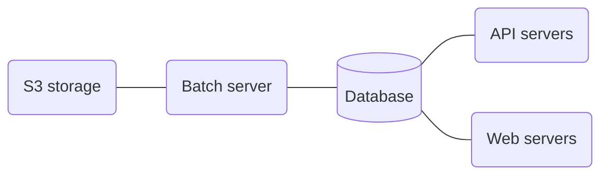

# Royllo explorer

## What is it ?

Royllo Explorer is an open source search engine for Taproot Assets living on the Bitcoin blockchain. Think of it as a "
Google" for Taproot Assets, providing you with a web interface and an API to search and discover these assets with ease.

The Key features for users include:

- Search for Taproot assets information using our user-friendly web interface.
- Add your proofs to our database to let the world discover and learn about your assets.
- Add your universe server to let us discover new assets automatically.
- Build new applications, services, and tools effortlessly using our GraphQL API.

A live version is available here: [https://explorer.royllo.org/](https://explorer.royllo.org/)

    

## How to run it ?

Royllo has several servers:

- Database Server ([Postgresql](https://hub.docker.com/_/postgres)).
- S3 storage Server (For example [Minio](https://hub.docker.com/r/minio/minio)).
- Batch server ([royllo/explorer-batch](https://hub.docker.com/r/royllo/explorer-batch)).
- API server ([royllo/explorer-api](https://hub.docker.com/r/royllo/explorer-api)).
- Web server ([royllo/explorer-web](https://hub.docker.com/r/royllo/explorer-web)).

Royllo also needs to access to three external
services: [Lnd, Tapd](https://github.com/royllo/lnd-taro-with-docker) & [Mempool](https://mempool.space/).

The easiest way to run it is to use the `docker-compose` file provided in this repository.
Just run : `docker-compose up`

## Contact

Feel free to contact me: [straumat](https://github.com/straumat)
