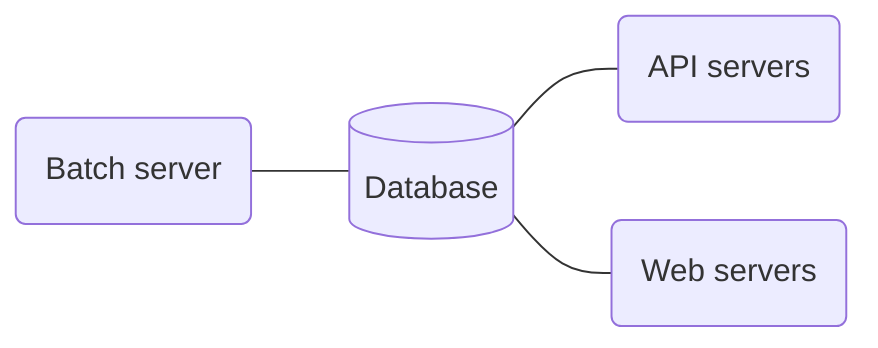

# Royllo explorer

## What is it ?

Royllo explorer is like "Google"
for [Taproot Assets](https://docs.lightning.engineering/the-lightning-network/taproot-assets).

Once deployed:

- Anyone can search for Taproot assets by name, asset id or description with the web interface.
- Anyone can view an asset, its description and all its proofs.
- Anyone can add proofs to Royllo explorer. They will be validated and added to the Royllo database.
- Anyone can do the things above by using the GraphQL API.

A live version is available here: [https://explorer.royllo.org/](https://explorer.royllo.org/)

    

## How to run it ?

Royllo has four components:

- A Postgresql Database Server ([Release 15](https://hub.docker.com/_/postgres)).
- A Batch server ([royllo/explorer-batch](https://hub.docker.com/r/royllo/explorer-batch)).
- An API server ([royllo/explorer-api](https://hub.docker.com/r/royllo/explorer-api)).
- A Web server ([royllo/explorer-web](https://hub.docker.com/r/royllo/explorer-web)).

Royllo also needs to access to three external
services: [Lnd, Tapd](https://github.com/royllo/lnd-taro-with-docker) & [Mempool](https://mempool.space/).

The easiest way to run it is to use the `docker-compose` file provided in this repository.
Just run : `docker-compose up`

## Contact

Feel free to contact me: [straumat](https://github.com/straumat)