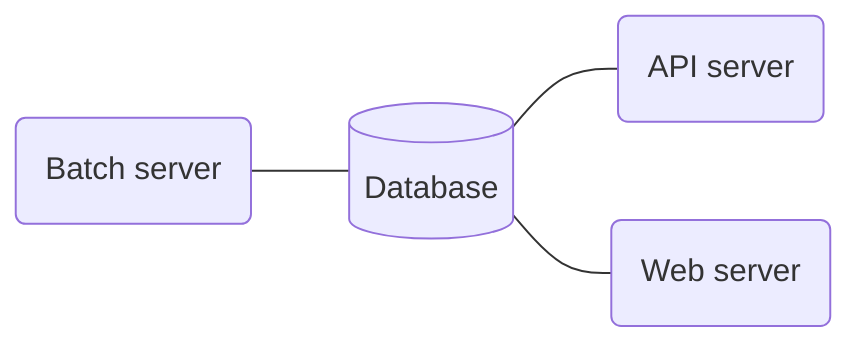

# Royllo explorer

## What is it ?

Royllo explorer is like "Google" for [Taro Assets](https://docs.lightning.engineering/the-lightning-network/taro).

Once deployed:

- Anyone can search for Taro assets by name, asset id or description with the web interface.
- Anyone can view an asset, it's description and all its proofs.
- Anyone can add proofs to Royllo explorer. They will be validated and added to Royllo database.
- Anyone can do the things above by using the GraphQL API.

    

## How to run it ?

Royllo has four components:

- A Postgresql Database Server ([Release 15](https://hub.docker.com/_/postgres)).
- A Batch server ([royllo/explorer-batch](https://hub.docker.com/r/royllo/explorer-batch)).
- An API server ([royllo/explorer-api](https://hub.docker.com/r/royllo/explorer-api)).
- A Web server ([royllo/explorer-web](https://hub.docker.com/r/royllo/explorer-web)).

Royllo also needs to access two external services: Lnd & Taro & Mempool.

The easiest way to run it is to use the docker-compose file provided in this repository.
Just run : `docker-compose up`

## Contact

feel free to contact me: [straumat](https://github.com/straumat)