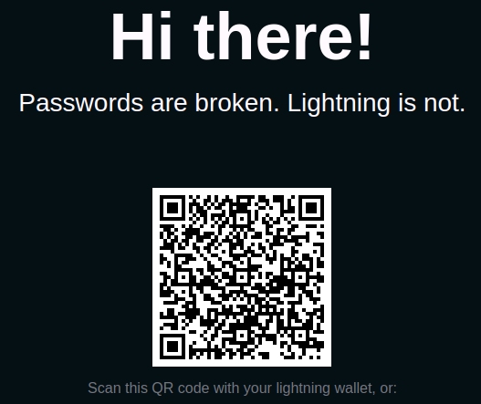

# Bitcoin & Java: a guide to LNURL-auth with Spring Boot.

[LNURL-auth](https://lightninglogin.live/) is an authentication protocol that authenticates a user using a digital
signature only. The protocol can be used as a replacement for email/username, password, social media, 2FA, forgotten
password... A big win for security and privacy. All the user need to have is a lightning wallet that supports LNURL.

This is the solution I choose for my project Royllo: a search engine / explorer for Taproot Assets living on the
Bitcoin blockchain. To implement it, I used a great spring boot
starter: [https://github.com/theborakompanioni/bitcoin-spring-boot-starter](https://github.com/theborakompanioni/bitcoin-spring-boot-starter).

-----

## A secure and fast solution.

The first thing is, of course, to have a compatible lightning wallet like [phoenix](https://phoenix.acinq.co/) (you
don't need to own bitcoins).

When you arrive at a website using LNURL-auth like [lightninglogin.live](https://lightninglogin.live/) and you click on
the login button, you will see a qr code appears:



Start your lighting wallet, click on send button, scan the qr code and you are logged, voilà! no email, password, phone
number… have been exchanged…

-----

## How it works?

The specification can be found [here](https://github.com/lnurl/luds/blob/luds/04.md).

### Step 1: The server generates a login url (in the qr code).

Each time a new login request is made, a new lnurl-auth url is created, and it looks like this: It will look like
this: `https://site.com?tag=login&k1=RANDOM`

The `tag` parameter with value set to login which means no GET should be made yet.

The `k1` parameter is a randomly generated token that serves as a challenge. It is unique for each authentication
request. As we will see later, the lightning wallet is expected to sign this `k1` token.

### Step 2: The user scans the qr code with its lighting wallet.

Once the lighting wallet retrieves the qr code, it decodes the two parameters (`tag` & `k1`) and retrieve the domain
name used (in our example `site.com`).

The domain name is then used by the wallets as material for key derivation. This means the master key of your wallet
plus the domain will generate what we call a linking key that will only be used for site.com (just like all the keys
generated from your master key). It's called the `linking private key`.

### Step 3: The lighting wallet calls the server login page.

The lightning wallet will now call the login page with the following parameters:

```
sig=<hex(sign(utf8ToBytes(k1), linkingPrivKey))>&key=<hex(linkingKey)>
```

The `sig` parameter contains the signature of the `k1` using the `linking private key`.
The `key` parameter contains the `linking public key`.

### Step 4: the server makes the verification.

The server receives the `sig` parameter that should contain the signature of the `k1` value made by the wallet with the
`linking private key`.

The first thing to do for the server is to verify the `k1` value's signature created by the lighting wallet and
transmitted with the `sig` parameter. This is done quite simply by using the `linking public key` transmitted with
the `key` parameter.

After this verification, we can create or retrieve the user !

-----

## Using bitcoin-spring-boot-starter.

Integrating LNURL-auth in Java/Spring boot is quite simple
with https://github.com/theborakompanioni/bitcoin-spring-boot-starter.

In order to use LNURL-auth, you must serve your application over https (no self-signed cert allowed). To make it easy, I
advise you to use [ngrok](https://ngrok.com). It will create a public address with a valid SSL for your local web
server.

It's quite simple, create a ngrok account, install the ngrok application, configure the token. Then, after starting your
application (on port 8080 for example), just run: `ngrok http 8080` and you will get:

```
Session Status online
Forwarding https://6a8b-92.ngrok-free.app -> http://localhost:8080
```

When you will type `https://6a8b-92.ngrok-free.app` in your browser, you will access your local server with a valid SSL
certificate.

### Adding bitcoin-spring-boot-starter.

Adding bitcoin-spring-boot-starter is quite easy, add this dependency to your java spring boot project:

```xml

<dependency>
    <groupId>io.github.theborakompanioni</groupId>
    <artifactId>spring-lnurl-auth-starter</artifactId>
</dependency>
```

### Database & domain objects modification.

To represent a user, we already have
a [user](https://github.com/royllo/explorer/blob/development/backend/explorer-core/autoconfigure/src/main/java/org/royllo/explorer/core/domain/user/User.java)
domain object and
a [user database script](https://github.com/royllo/explorer/blob/development/backend/explorer-core/autoconfigure/src/main/resources/db/changelog/1.0.0/table/table-application_user.xml)
to create the table. Nothing special here.

We now add
a [UserLnurlAuthKey](https://github.com/royllo/explorer/blob/461-user-asset-data-management/backend/explorer-core/autoconfigure/src/main/java/org/royllo/explorer/core/domain/user/UserLnurlAuthKey.java)
object, its repository, and
its [sql creation script]https://github.com/royllo/explorer/blob/461-user-asset-data-management/backend/explorer-core/autoconfigure/src/main/resources/db/changelog/1.0.0/table/table-application_user_lnurl_auth_linking_key.xml).

This object is used to store all the linking keys and corresponding k1 of users.

### Implements LnurlAuthPairingService.

LnurlAuthPairingService is an interface provided by bitcoin-spring-boot-starter that you must implement. It declares two
methods:

**findPairedLinkingKeyByK1**: This method is called by the spring boot starter when a user has provided a k1 signed
with a linking key and everything is valid.
Usually, this is where you search if the linking key already exists in the database.
If not, you create a new user and store the linking key.
If yes, you just return the user, and you update the k1 used.

We decided to implement direct it in our existing [UserService](https://github.
com/royllo/explorer/blob/461-user-asset-data-management/backend/explorer-core/autoconfigure/src/main/java/org/royllo/explorer/core/service/user/UserServiceImplementation.java).